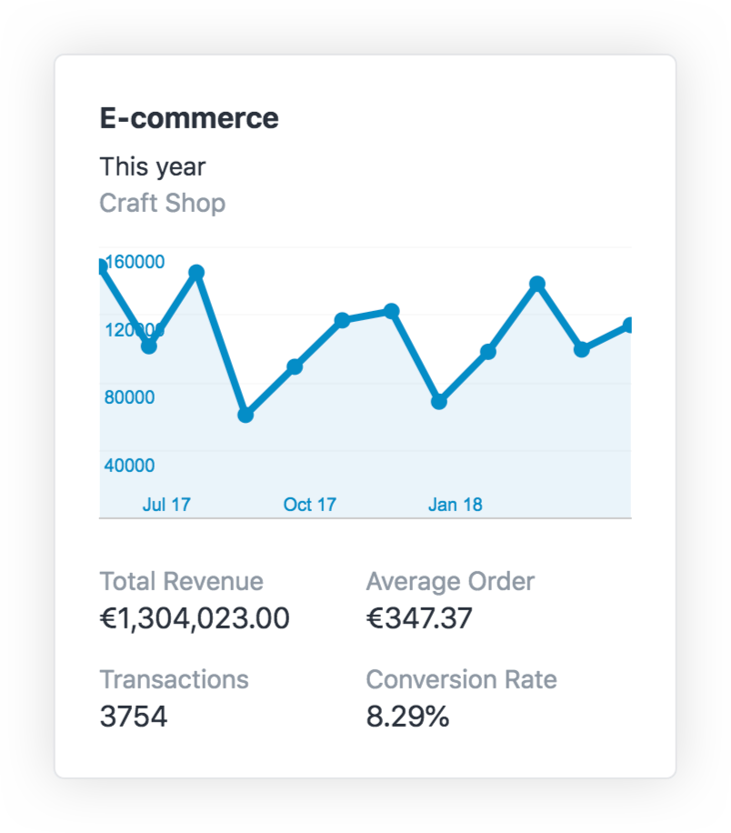
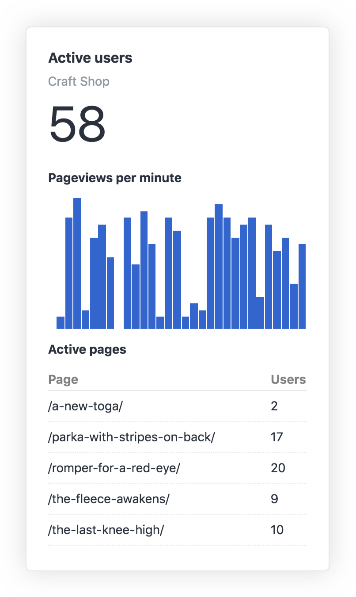

# Introduction

Customizable statistics widgets and entry tracking for Craft & Google Analytics.

## Licensing

The license fee for this plugin is $99 (license + one year of updates) via the Craft Plugin Store, then $29 per year for updates.

Licenses purchased before April 4 for Craft 2 have been grandfathered into a lifetime of free updates, and therefore can be used with Craft 3.
You can claim your existing licenses at [id.craftcms.com](https://id.craftcms.com).
