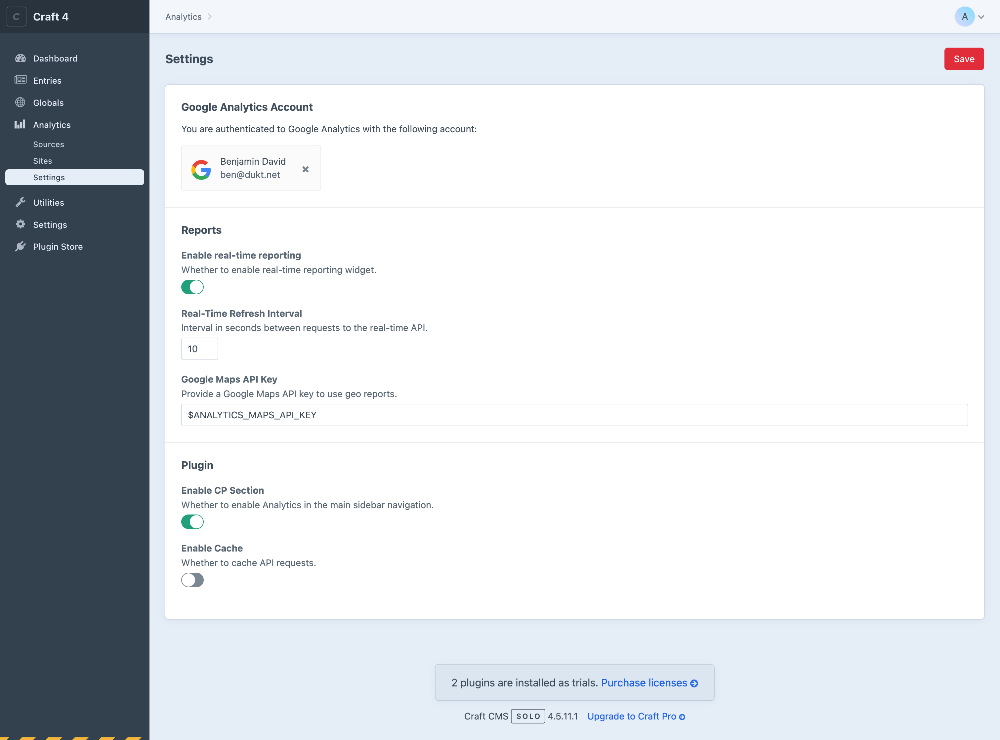

# Connect to Google Analytics

- Go to your Craft CMS control panel.
- Navigate to **Settings → Analytics → General Settings → OAuth Settings**.

## 1. Create the Google Developer Console project

- In another tab of your browser, open the [Google Developer Console](https://console.developers.google.com/).
- Click on the projects dropdown located next to the “Google APIs” logo.
- Click the “New project” button.
- Choose a project name and click “Create”.
- It might not automatically take you to your newly created project, so make sure that it's selected in the projects dropdown (next to the “Google APIs” logo).

## 2. Enable Google Analytics APIs

- In the [Google Developer Console](https://console.developers.google.com/), navigate to **API & Services → Library.**
- Search for “analytics” in the API Library.
- Enable the following APIs:
  - Google Analytics API
  - Google Analytics Reporting API

## 3. Configure the OAuth consent screen

When connecting to your Google Analytics account, your website requests authorizations to access Google Analytics APIs. Google displays a consent screen to the user including a summary of your project and its policies, and the requested scopes of access. The consent screen needs to be configured for the authorization process to work properly.

- In the [Google Developer Console](https://console.developers.google.com/), navigate to **API & Services → OAuth consent screen**.
- Select the “User Type” that fits your needs, in this guide, we will choose “Internal”, and click “Create”.
- Fill the mandatory fields:
    - App name
    - User support email
    - Developer email address
- Click “Save and continue”.
- On the “Scopes” screen, don’t do anything and click “Save and continue”.
- Google then shows you a summary, click the “Back to dashboard” button.

## 4. Create the OAuth client

- Go to your Google Developer Console project.
- Navigate to **API & Services → Credentials**, click the “Create credentials” button and create a new “OAuth client ID”.
- On the next step, select the application type “Web Application” and choose a name for your web client.
- In the “Authorized JavaScript origins”, click the “Add URI” button.
- Copy the authorized javascript origin URL from the Analytics plugin OAuth settings, in your Craft CMS control panel.
- In the “Authorized redirect URIs”, click the “Add URI” button.
- Copy the authorized redirect URL from the Analytics plugin OAuth settings, in your Craft CMS control panel.
- Click “Save”.

## 5. Configure the OAuth client

Once the OAuth client is created, Google will provide you with a client ID and secret.

- Copy the client ID & secret.
- Go to your Craft CMS control panel.
- Navigate to **Settings → Analytics → General Settings → OAuth Settings**.
- Paste the OAuth client and secret into the corresponding fields and click “Save”.

## 6. Connect to Google Analytics

You should now be ready to connect to your Google Analytics account:

- Go to your Craft CMS control panel.
- Navigate to **Settings → Analytics → General Settings** and click ”Connect”.

🎉
  
## What's next?

Now that your Craft CMS website is connected to Google Analytics, you can:

- Go to your dashboard and add some Analytics widgets.
- Create a [Report](report-field.md) field for your entries.