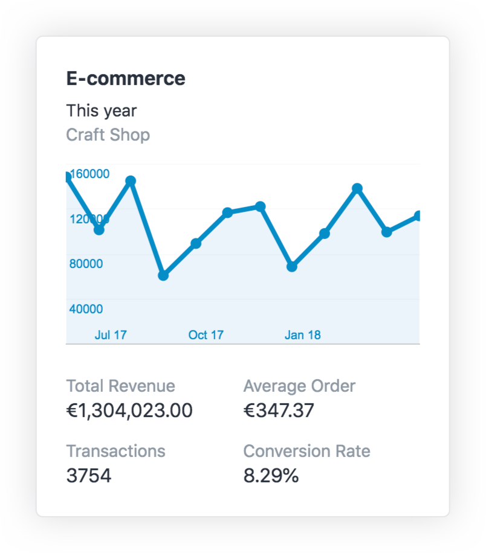

# E-commerce Widget

## The Widget

The E-commerce widget shows total revenue, transactions, average order and conversion rates data from Google Analytics.

## Configuration

The widget will use the currency defined in your View Settings on Google Analytics.

If you've just changed your currency on Google Analytics, you’ll need to do two things in Craft for the change to be taken into account:

1. Clear your cache in **CP → Utilities → Settings**
2. Save your view again in **CP → Settings → Analytics → Views**