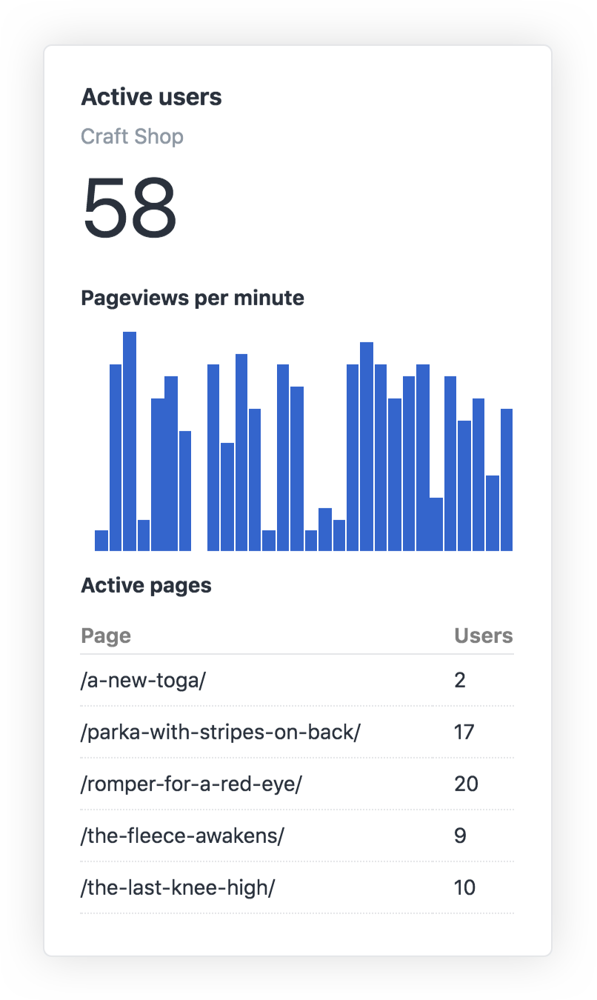

# Realtime Widget

## The Widget

The Realtime widget shows the currently active users on your website.

## Configuration

You can enable real-time reports in **CP → Settings → Analytics**.

The Realtime widget will not show up in the dashboard until Realtime is enabled in Analytics' settings.