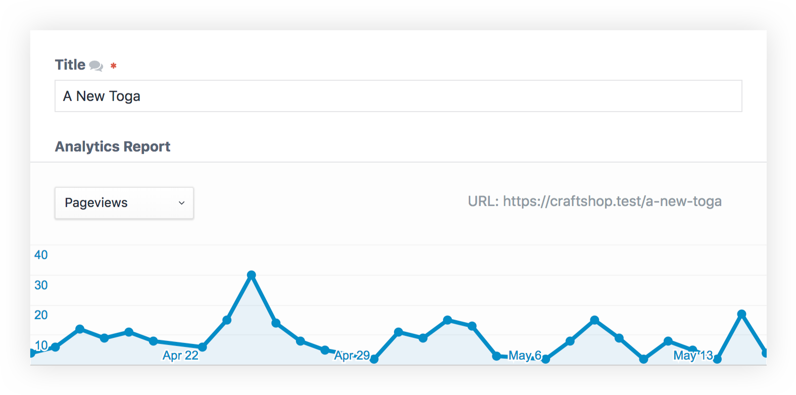

# Report Field

## The Field

The Analytics Report field displays statistics base on the URL of the entry the field belongs to. It's worth noting that the entry needs to be saved in order for the chart to start showing data.

## Output

This field doesn't have any output as its only purpose is to display entry statistics in the control panel.