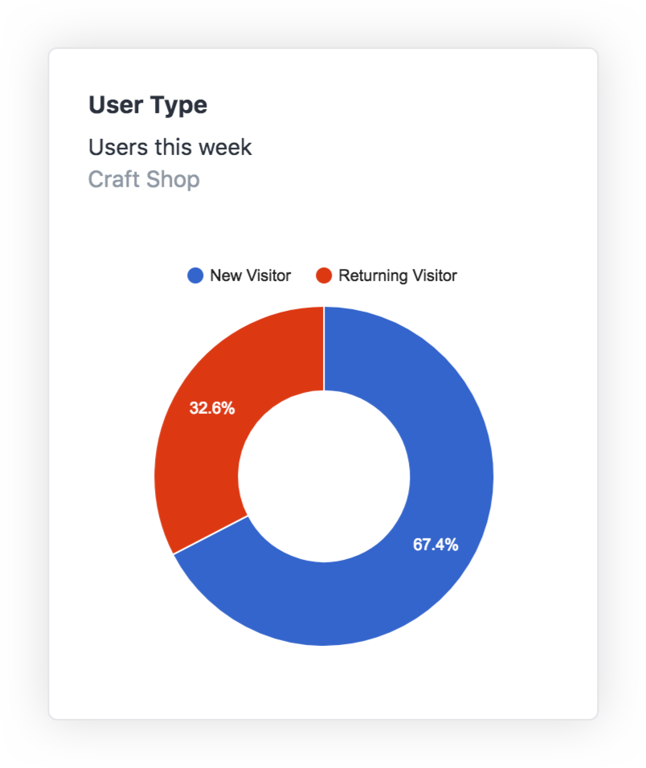

# Report Widget

## The Widget

The Analytics widget allows you to explore your Google Analytics statistics.

## Configuration

- **Metrics:** The metric of your graph
- **Dimensions:** The dimension of your graph
- **Graph:** Counter, area, table, pie, or geo chart.
- **Period:** Week, Month, Year

## Google Maps API key

The geo chart will require a Google Maps API key to access geocoding features. 

1. [Get a Google Maps API key](https://developers.google.com/maps/documentation/javascript/get-api-key).
2. Copy your Google Maps API key to your [`mapsApiKey`](configuration.md#mapsapikey) config.