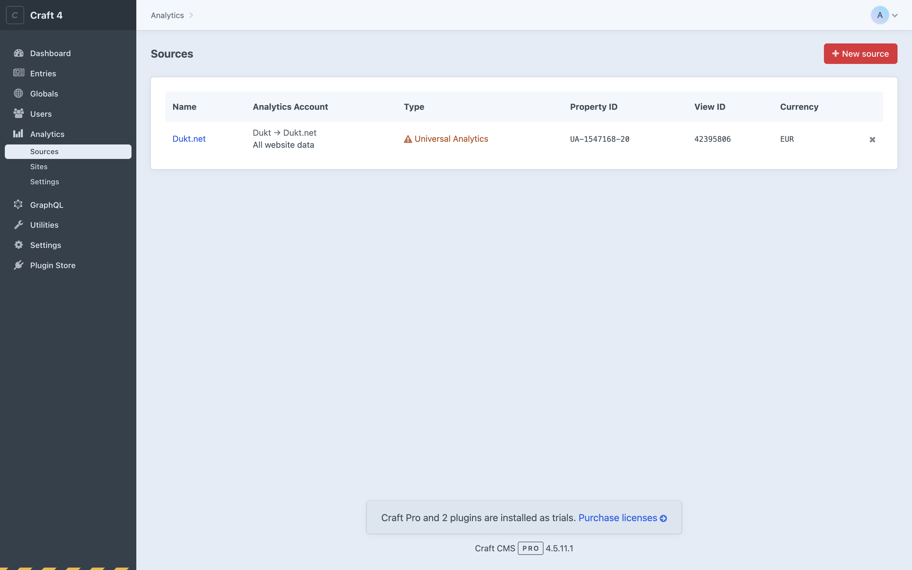

# Upgrading from UA to GA4

Sources using an Universal Analytics account can be upgraded to use a Google Analytics 4 account instead.

Select the source that you want to upgrade, then select a Google Analytics 4 account and save.

The plugin will try to upgrade all reporting widgets to new GA4 dimensions and metrics. Since not all dimensions and metrics are available in GA4, some widgets may stop working until a new dimension or metric is selected.

